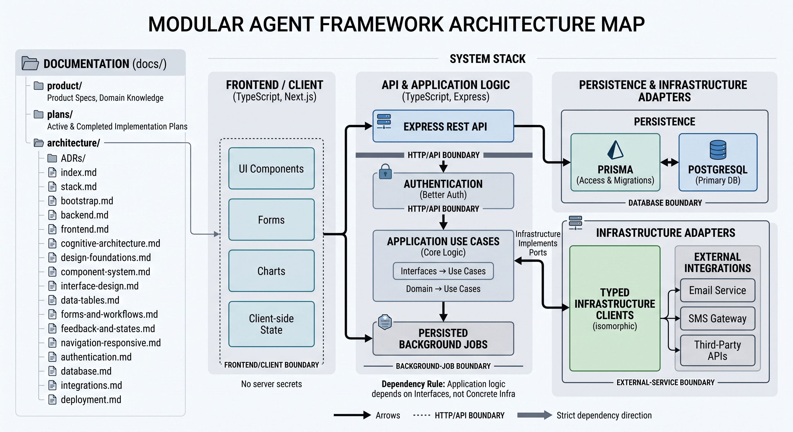

# CognitiveStack

<p align="center">
  
</p>

Software engineering specifications, prompt architectures, and modular skills for building
agentic systems.

`agent-skills` · `prompt-engineering` · `system-architecture` · `llm` · `workflows`

## What It Is

CognitiveStack is a Markdown knowledge system that a project installs next to its code, so
AI agents know how to work before they change anything.

It is not a code starter and not a library. It is the context layer: engineering
specifications, architectural boundaries, interface criteria, quality and security rules,
and reusable skills, written so that Codex, Claude, GitHub Copilot, or any other agent read
the same thing and reach the same decisions.

## Why It Exists

An agent writes code quickly, but without persistent context it tends to:

- invent a different pattern in every module;
- mix business rules with infrastructure;
- duplicate components and documentation;
- build interfaces straight from the database schema;
- expose technical detail on screen;
- skip states, permissions, tests, or migrations;
- rely on conversations the next agent never saw.

CognitiveStack turns those decisions into versioned, navigable, verifiable instructions
inside the repository itself.

## What It Contains

| Area           | Context included                                             |
| -------------- | ------------------------------------------------------------ |
| Agents         | Instructions for Codex, Claude, and GitHub Copilot           |
| Architecture   | Express.js, Next.js, layer boundaries, and integrations      |
| Data           | PostgreSQL, Prisma, and versioned migrations                 |
| Authentication | Better Auth, and rules against reinventing sessions          |
| Frontend       | shadcn/ui, Tailwind, shared forms, tables, and states        |
| UX criteria    | Screen brief, information tiers, and action budgets          |
| Visual design  | Tokens and scales for spacing, type, color, and motion       |
| Quality        | Definition of Done, testing, code review, and observability  |
| Performance    | Budgets, measurement, and anti-patterns                      |
| Security       | Principles, hardening per boundary, and threat model         |
| Execution      | Active plans, decisions, and reusable skills                 |
| Delivery       | Small commits, descriptive messages, and pull requests       |

### Skills

Procedures loaded only when a task needs them, in `.agents/skills/`:

`implement-feature` · `implement-operational-frontend` · `create-migration` · `review-code`
· `harden-security` · `optimize-performance` · `update-documentation` · `commit-changes`

## Reference Stack

Node.js and TypeScript, Express.js for the REST API, Next.js and React on the frontend,
Better Auth for identity and sessions, PostgreSQL with Prisma, Tailwind CSS and shadcn/ui,
React Hook Form with Zod, Axios for server-side integrations, pnpm through Corepack, and
Docker for deployment.

The stack is a default decision, not an irreversible constraint. A project that needs to
deviate records the reason and its consequences in an ADR.

## How The Context Works

```text
AGENTS.md
  -> states what to read and how to work
ARCHITECTURE.md
  -> shows components, boundaries, and dependencies
docs/product/
  -> explains what the product must do
docs/architecture/
  -> explains how it must be built
docs/plans/
  -> keeps the strategy behind complex work
.agents/skills/
  -> runs repeatable procedures
docs/quality/ + docs/security/
  -> defines when a change is acceptable
```

The point is not to load the whole repository into every prompt. An agent starts from a
small map and opens only the source of truth the task requires.

## Interface Criteria

The most developed part of the context keeps an operational panel from becoming a pile of
cards, filters, and messages. Designing is deciding what does not appear:

- answer in writing who uses the screen, what they decide, with what information, and what
  their single primary action is, before implementing it;
- design from the user's job, never from the database schema;
- never show a value only because the backend returns it;
- tier information P0 to P3, and keep technical detail out of the initial view;
- limit simultaneous actions: one primary, one or two secondary, the rest disclosed;
- take spacing, type, color, radius, and motion values from documented scales;
- cover every state: loading, empty, partial, error, permission, and success;
- verify keyboard, mobile, light, and dark before calling anything done.

## Repository Map

```text
.
├── AGENTS.md                       # Permanent rules for agents
├── ARCHITECTURE.md                 # High-level technical map
├── CLAUDE.md                       # Entry point for Claude
├── .agents/skills/                 # Reusable procedures
├── .github/                        # Copilot instructions
├── .codex/                         # Configuration, not product knowledge
└── docs/
    ├── product/                    # Product, domain, and features
    ├── architecture/               # Stack, boundaries, and patterns
    ├── plans/                      # Active work, completed work, and debt
    ├── quality/                    # Testing, review, commits, performance, done
    ├── security/                   # Principles, hardening, and threats
    └── generated/                  # Derived references
```
